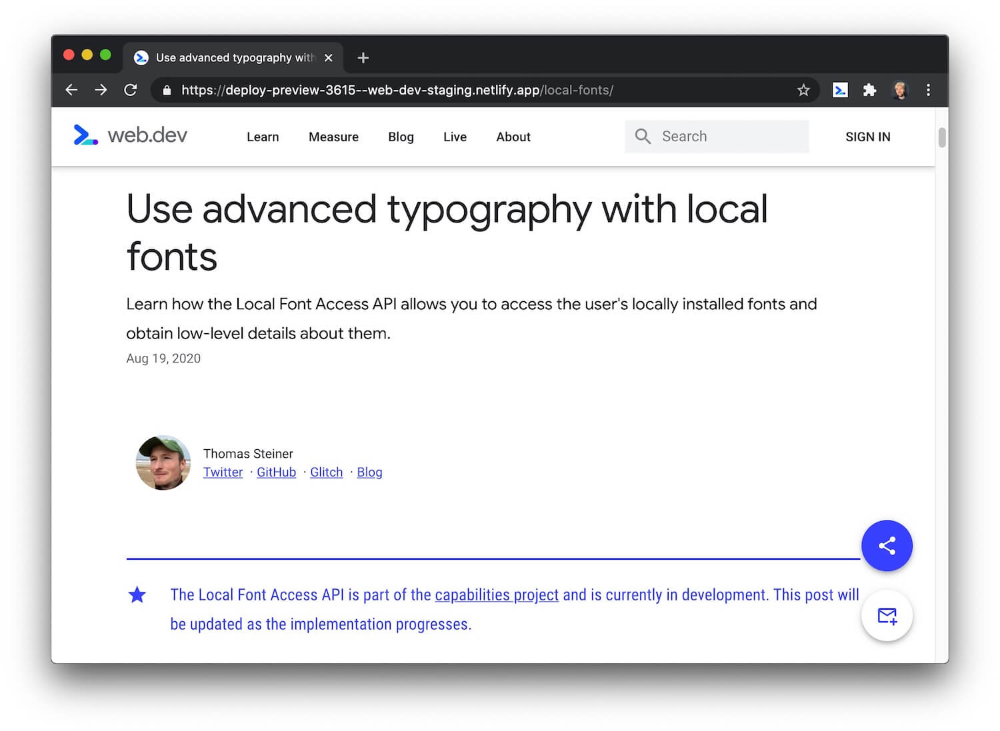
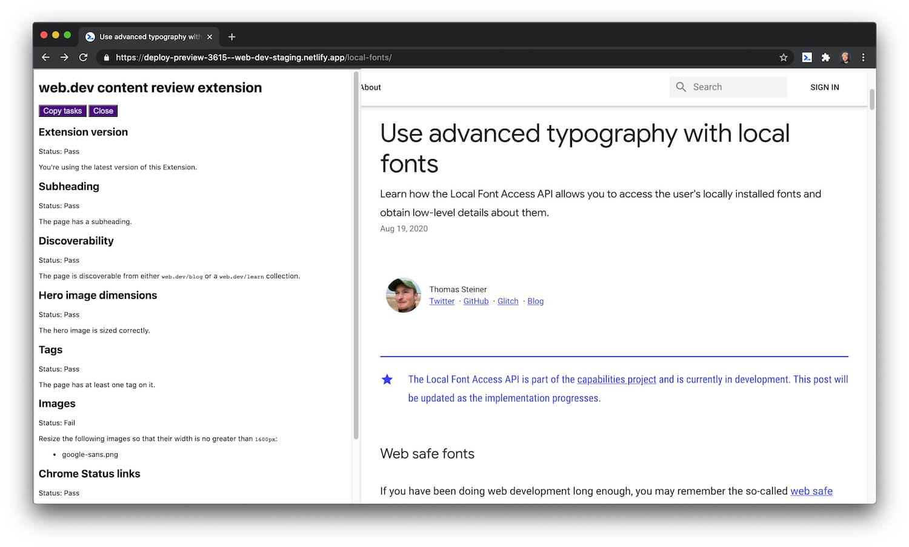
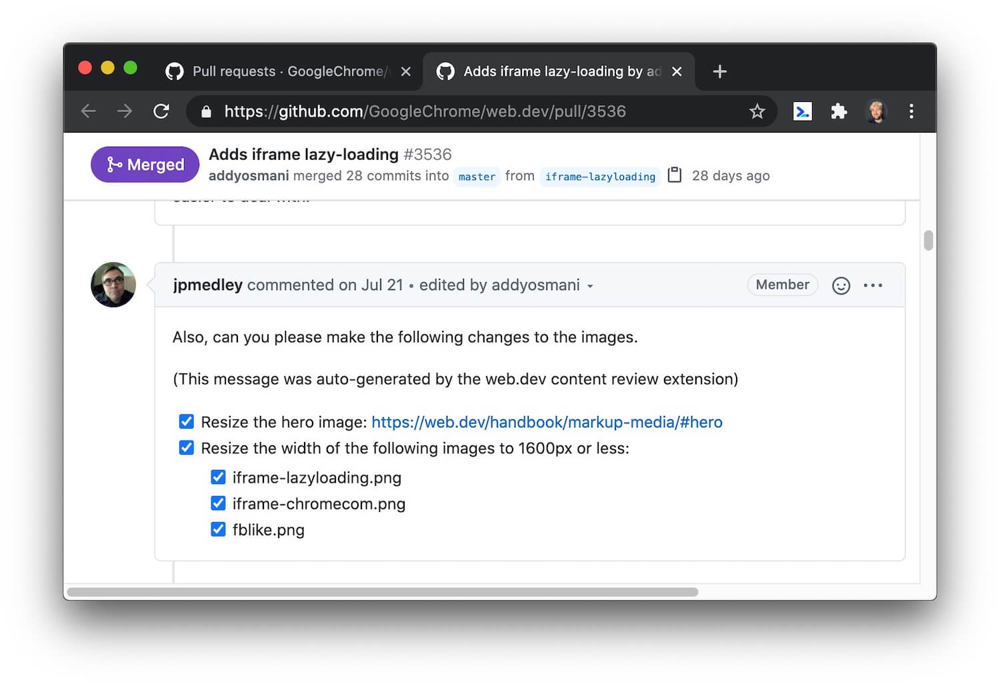

# review-extension

A Chrome Extension that standardizes and automates web.dev content reviews.

## Overview

When someone submits a PR (example) to add new content to web.dev,
the web.dev repository publishes the content on a staging site:



Opening this Extension on the staging site (or the production site)
runs a series of automated tests:



Clicking **Copy tasks** copies a list of tasks (formatted as Markdown) to the
reviewer's clipboard:

```
(The requested changes below were auto-generated by the web.dev content review extension)

- [ ] Resize the width of the following images to 1600px or less:
  - [ ] google-sans.png
```

The reviewer then pastes these tasks into the PR and leaves it up to the author to
fix the issues:



## Setup

1. Clone this repository:

       git clone git@github.com:kaycebasques/review-extension.git

1. Go to `chrome://extensions`.
1. Click **Load unpacked**.
1. Select the directory where you cloned this repository.
1. (Optional) [Pin the Extension](https://www.chromestory.com/2019/05/pinned-extensions/) for easy access.

<!--

## TODO

* caniuse should link to #feat not #search
* Replace GIFs with videos (use the LIghthouse audit)
* Videos have playsinline attribute (and all the other attributes)
* YouTube videos are embedded with component
* Check that title matches URL
* Check for images above 250KB
* If no tags are present, point them to `postTags.json`
* 404 links
* Correct order of headings
* Quotes around link text
* Tables should have `w-table-wrapper`
* Links to web.dev pages should omit `https://web.dev`
* Link with anchor should jump to section... this is probably automatable...
  get the hash and then check for an element with that ID

$$('a').forEach(a => {
    if (!a.href.startsWith(`${window.location.origin}${window.location.pathname}`)) return;
    if (!document.querySelector(new URL(a.href).hash)) console.log(a.href);
});

* Use PSI to find performance problems
* Blog post only has the `blog` tag
* Convert GIFs to videos
* Videos should not be hosted in the repository
* Remove `en-US` from MDN links… make it more generic though…
* Acronyms should be defined before using (this one might be difficult to automate)
* Chromium, not Chrome
* Remove `hl=en`
* Chrome Status URLs should use `feature/` not `features/`
* Links to Tooling.Report should have UTM parameters
* Nitpick: Subhead should end with period.
* Glitch should use `/embed/` not `/edit/`
* (Maybe more appropriate for GitHub Bot) Contributor photos are correct dimensions

-->